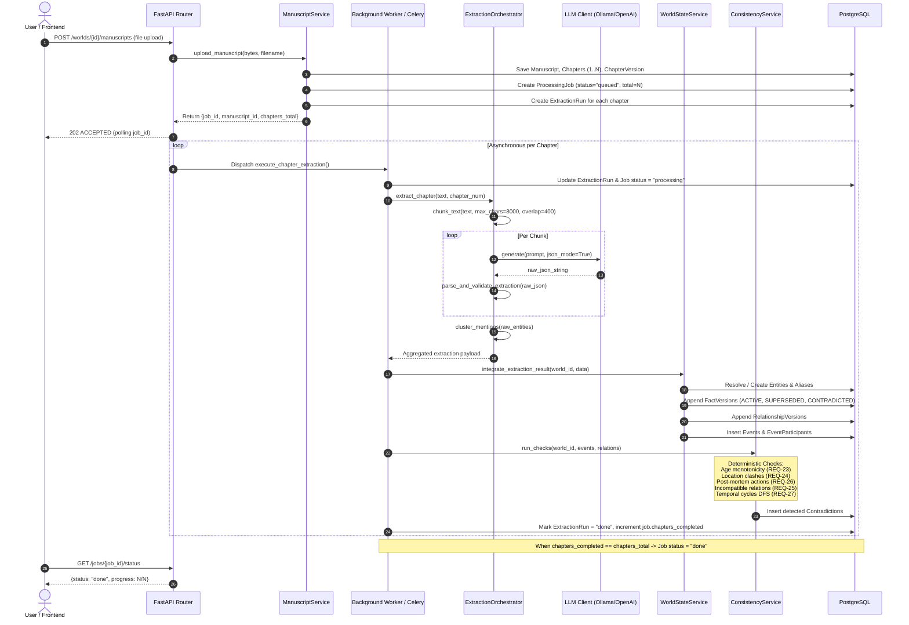

# Orion World State Engine — System Architecture

This document provides a mechanistic, ground-truth explanation of the Orion backend architecture.

---

## 1. System Topology

```
                  ┌──────────────────────────────────────────────┐
                  │                 Web Browser                  │
                  │        (Frontend React / Zustand Store)      │
                  └───────────────────────┬──────────────────────┘
                                          │  HTTPS / REST API
                                          ▼
┌─────────────────────────────────────────────────────────────────────────────────┐
│                                FastAPI Server                                   │
│  ┌───────────────────────────────────────────────────────────────────────────┐  │
│  │                    API Layer (Routes & Dependencies)                      │  │
│  │    /auth    /worlds    /manuscripts    /chapters    /jobs    /entities    │  │
│  │             /graph     /timeline       /contradictions       /chat        │  │
│  └──────────────────────────────────────┬────────────────────────────────────┘  │
│                                         │ Invokes                               │
│  ┌──────────────────────────────────────▼────────────────────────────────────┐  │
│  │                             Service Layer                                 │  │
│  │  - ManuscriptService   - ChapterService   - JobService    - EntityService │  │
│  │  - WorldStateService   - ConsistencyService (Rules)       - GraphService  │  │
│  │  - TimelineService     - ChatService                                      │  │
│  └──────────────────────┬───────────────────────────────┬────────────────────┘  │
│                         │ Calls                         │ Dispatches            │
│  ┌──────────────────────▼───────────────┐  ┌────────────▼────────────────────┐  │
│  │          Repository Layer            │  │     Background Task Runner      │  │
│  │   (Clean DB Query Abstractions)      │  │ (FastAPI BackgroundTasks or     │  │
│  └──────────────────────┬───────────────┘  │  Celery / Redis Worker)         │  │
│                         │                  └────────────┬────────────────────┘  │
└─────────────────────────┼───────────────────────────────┼───────────────────────┘
                          │                               │
                          ▼                               ▼
       ┌─────────────────────────────────────┐  ┌─────────────────────────────────┐
       │         PostgreSQL Database         │  │     LLM Extraction Pipeline     │
       │    (12 Tables, ACID, Versioned)     │  │  - Text Chunker (~8k chars)     │
       │  - users           - worlds         │  │  - Prompt Orchestrator          │
       │  - manuscripts     - chapters       │  │  - Ollama / OpenAI Provider     │
       │  - chapter_vers    - jobs           │  │  - JSON Sanitizer & Parser      │
       │  - extraction_runs - entities       │  │  - Coreference Clustering       │
       │  - facts           - relationships  │  │  - Fact/Relationship Resolvers │
       │  - events          - contradictions │  └─────────────────────────────────┘
       └─────────────────────────────────────┘
```

---

## 2. End-to-End Extraction Pipeline Lifecycle

When an author uploads a manuscript (or updates a chapter), the following state transitions occur:



---

## 3. Structural Layers & Separation of Concerns

### Layer 1: API Layer (`app/api/`)
- **`deps.py`**: Injects request-scoped database sessions (`get_db`) and validates Bearer JWT tokens (`get_current_user`, `get_current_user_optional`).
- **`v1/routes/`**: Handles HTTP serialization, URL query parameters, status codes (201 Created, 202 Accepted, 204 No Content, 404 Not Found), and file uploads (`multipart/form-data`).

### Layer 2: Service Layer (`app/services/`)
- Pure Python business logic orchestrating multiple repositories and pipelines.
- Implements transaction boundaries and domain policies.
- Example: [`WorldStateService`](../app/services/world_state_service.py) does not write raw SQL; it coordinates [`EntityRepository`](../app/repositories/entity_repo.py), [`FactRepository`](../app/repositories/fact_repo.py), and [`ConsistencyService`](../app/services/consistency_service.py).

### Layer 3: Repository Layer (`app/repositories/`)
- Implements the Repository Pattern via [`BaseRepository[ModelType]`](../app/repositories/base.py).
- Provides type-safe CRUD operations (`get`, `get_all`, `create`, `update`, `delete`, `filter_by`).
- Specialized repositories encapsulate complex joins and query optimizations (e.g. `get_entity_with_facts` with `joinedload`).

### Layer 4: Pipeline Layer (`app/pipeline/`)
- **`llm_client.py`**: Unified interface supporting local Ollama (`/api/chat`), OpenAI API, and an offline heuristic Mock provider for testing.
- **`parsers/extraction_parser.py`**: Strips markdown fences, fixes trailing commas, validates entity/relationship/event structures.
- **`resolution/entity_resolution.py`**: Computes Jaccard word token similarity and substring containment to cluster ambiguous mentions to canonical entities.
- **`resolution/fact_resolution.py`**: Compares new observations with current `ACTIVE` fact versions; flags immutable changes as `CONTRADICTED` and state transitions as `SUPERSEDED`.

### Layer 5: Worker Layer (`app/workers/`)
- Asynchronous execution engine powered by Celery and Redis.
- Fallback capability: Every Celery task function has a pure Python execution counterpart (`execute_chapter_extraction`), enabling local dev execution via FastAPI `BackgroundTasks` without needing Redis running.

---

## 4. Performance Budgets (SRS Section 5.1)

| Operation | Latency Budget | Architectural Strategy |
|---|---|---|
| **Single Chapter Extraction** | **≤ 10 seconds** | Stream chunks to quantized local model (or fast API); parallel chunk dispatch; token-safe boundaries. |
| **Contradiction Detection** | **≤ 5 seconds** | 100% deterministic Python in-memory graph algorithms (DFS cycle detection, hash table lookups). Zero LLM overhead. |
| **Character Chat Response** | **≤ 3 seconds** | Filtered context window (top 25 entities, active relations, recent events); low temperature (0.3). |
| **World Graph Retrieval** | **≤ 500 ms** | Optimized SQLAlchemy joined loads; degree calculation in single pass. |
